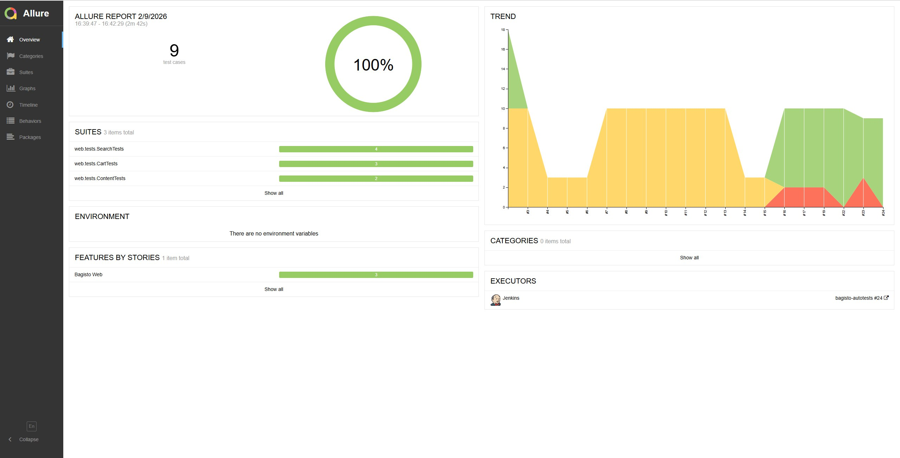
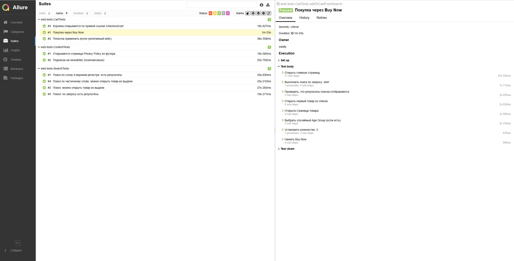
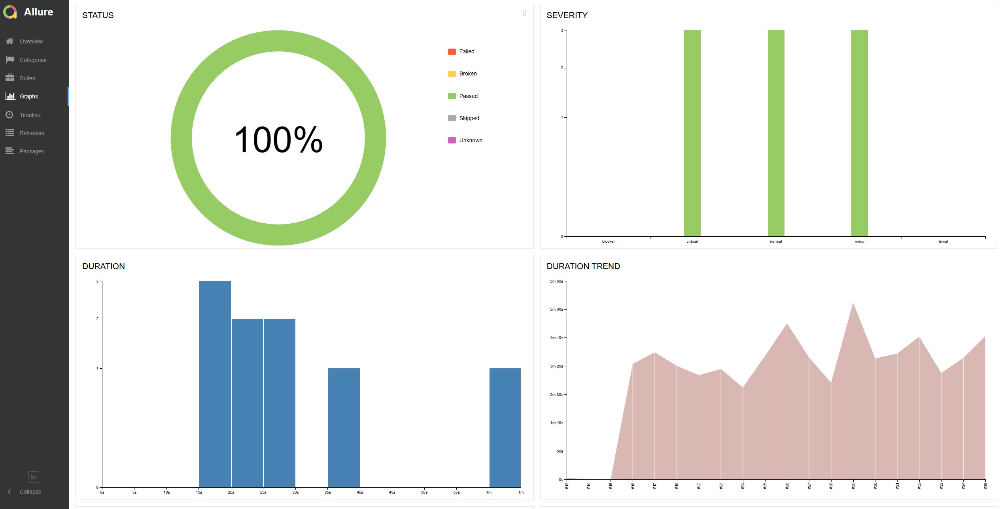
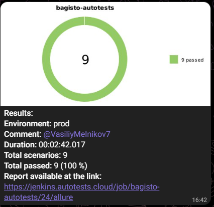
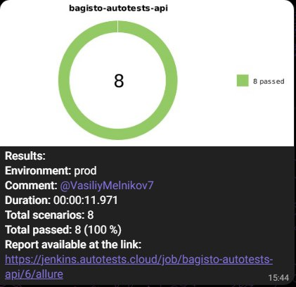
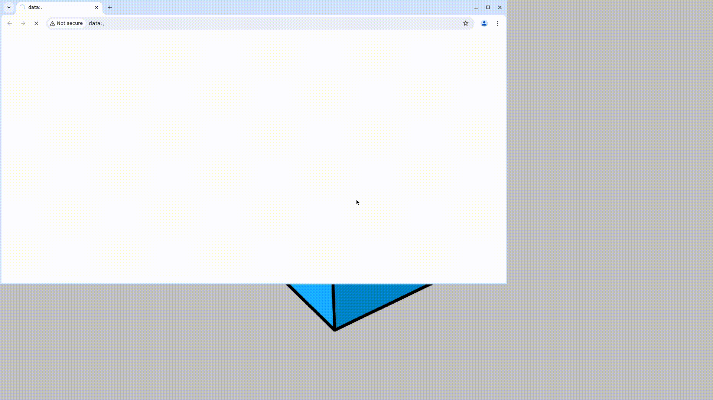

# Проект по автоматизации тестирования **Bagisto Demo Store**

Тестовый проект по автоматизации **UI- и API-тестов**  
для open-source e-commerce платформы **Bagisto**

🔹 UI: https://demo.bagisto.com  
🔹 API: https://demo.bagisto.com/bagisto-api-demo-common

Проект выполнен в демонстрационных и учебных целях  
(построение портфолио QA Automation Engineer).

---

## 📌 Содержание

- [Технологии и инструменты](#tools)
- [Структура проекта](#structure)
- [UI автотесты](#ui-tests)
- [API автотесты](#api-tests)
- [Сборка в Jenkins](#jenkins)
- [Запуск из терминала](#run)
- [Allure отчёт](#allure)

  <a id="tools"></a>
---

## 🛠 Технологии и инструменты

| Технология | Назначение |
|-----------|-----------|
| **Java 17** | язык разработки |
| **Gradle** | система сборки |
| **JUnit 5** | тестовый фреймворк |
| **Selenide** | UI-автоматизация |
| **REST Assured** | API-тестирование |
| **Allure** | отчёты |
| **Jenkins** | CI/CD |
| **Owner** | управление конфигурациями |
| **Lombok** | модели данных |
| **Jackson** | JSON сериализация |

---

<a id="structure"></a>
## 📁 Структура проекта

```text
bagisto-autotests
├── build.gradle
├── gradle.properties
├── settings.gradle
├── README.md
├── notifications
│   └── allure-notifications-4.2.1.jar
└── src
    └── test
        ├── java
        │   ├── api
        │   │   ├── config
        │   │   │   └── ApiConfig.java
        │   │   ├── helpers
        │   │   │   ├── AllureRestAssuredFilter.java
        │   │   │   └── CustomerRegisterHelper.java
        │   │   ├── models
        │   │   │   ├── auth
        │   │   │   │   ├── LoginRequest.java
        │   │   │   │   ├── LoginResponse.java
        │   │   │   │   └── RegisterCustomerRequest.java
        │   │   │   ├── catalog
        │   │   │   │   ├── BaseImage.java
        │   │   │   │   ├── Category.java
        │   │   │   │   ├── Product.java
        │   │   │   │   └── Translation.java
        │   │   │   └── common
        │   │   │       ├── Links.java
        │   │   │       ├── Meta.java
        │   │   │       ├── MetaLink.java
        │   │   │       └── PaginatedResponse.java
        │   │   ├── specs
        │   │   │   └── Specs.java
        │   │   └── tests
        │   │       ├── ApiTestBase.java
        │   │       ├── CatalogCategoriesTests.java
        │   │       ├── CatalogProductsTests.java
        │   │       └── CustomerRegisterTests.java
        │   │
        │   └── web
        │       ├── config
        │       │   ├── WebDriverConfig.java
        │       │   └── WebDriverConfigProvider.java
        │       ├── data
        │       │   └── TestData.java
        │       ├── helpers
        │       │   └── Attach.java
        │       ├── pages
        │       │   ├── CartPageObject.java
        │       │   ├── HomePageObject.java
        │       │   ├── ProductPageObject.java
        │       │   └── SearchResultsPageObject.java
        │       └── tests
        │           ├── BaseTest.java
        │           ├── CartTests.java
        │           ├── ContentTests.java
        │           └── SearchTests.java
        │
        └── resources
            ├── config
            │   ├── local.properties
            │   └── remote.properties
            └── tpl
                ├── request.ftl
                └── response.ftl

```
---

<a id="ui-tests"></a>
## ✅ Примеры автоматизированных UI тест-кейсов

UI-тесты покрывают базовый **smoke- и critical-набор** пользовательских сценариев интернет-магазина **Bagisto Demo**  
➡️ https://demo.bagisto.com

Тесты сгруппированы по функциональности и реализованы с использованием **Page Object Model** и **Allure Steps**.

---

### 🛒 CartTests

---

✔ **Добавление товара в корзину из поиска**

- открывается главная страница
- выполняется поиск товара (например, `shirt`)
- отображаются результаты поиска
- открывается первый товар из выдачи
- (если требуется) выбирается параметр **Age Group**
- устанавливается количество товара
- товар добавляется в корзину
- корзина открывается
- товар присутствует в корзине

---

✔ **Корзина открывается по ссылке `cart`**

- открывается главная страница
- осуществляется переход по прямой ссылке `/checkout/cart`
- страница корзины успешно отображается

---

✔ **Попытка применить невалидный купон**

- открывается главная страница
- выполняется поиск товара
- товар добавляется в корзину
- открывается корзина
- открывается форма **Apply Coupon**
- вводится невалидный купон (например, `A68OLA56`)
- отображается сообщение об ошибке применения купона

---

### 📄 ContentTests

---

✔ **Открывается страница Privacy Policy из футера**

- открывается главная страница
- в футере выполняется клик по ссылке **Privacy Policy**
- открывается страница `/privacy-policy`
- основной контент страницы отображается

---

✔ **Подписка на newsletter (позитивный smoke-сценарий)**

- открывается главная страница
- выполняется подписка на newsletter
- используется валидный email (генерируется динамически)
- подписка проходит успешно

---

### 🔍 SearchTests

---

✔ **Поиск по слову в верхнем регистре: есть результаты**

- открывается главная страница
- выполняется поиск по запросу в верхнем регистре (например, `SHI`)
- результаты поиска отображаются

---

✔ **Поиск по частичному слову: можно открыть товар из выдачи**

- открывается главная страница
- выполняется поиск по частичному запросу (например, `sh`)
- результаты поиска отображаются
- открывается первый товар из выдачи
- страница товара успешно открыта

---

✔ **Поиск: можно открыть товар из выдачи**

- открывается главная страница
- выполняется поиск товара
- результаты поиска отображаются
- осуществляется переход в карточку товара
- карточка товара загружена корректно

---

✔ **Поиск: по запросу есть результаты**

- открывается главная страница
- выполняется поиск по валидному запросу
- результаты поиска присутствуют на странице

---

### 🏷 Аннотации Allure

Каждый UI-тест помечен аннотациями:

- `@Epic`
- `@Feature`
- `@Story`
- `@Severity`
- `@Owner`
- `@DisplayName`

Это позволяет:

- удобно анализировать отчёты
- выделять **critical-сценарии**
- использовать Allure-отчёт как тестовую документацию
---

<a id="api-tests"></a>
## ✅ Примеры автоматизированных API-тест-кейсов

API-тесты покрывают **smoke-, normal- и critical-сценарии** для **Shop API** интернет-магазина **Bagisto Demo**  
➡️ https://demo.bagisto.com/bagisto-api-demo-common

Тесты реализованы с использованием **REST Assured**, **POJO-моделей**, контрактных проверок и **Allure-аннотаций**.  
Основной фокус — корректность HTTP-ответов, структура JSON и маппинг в Java-модели.

---

### 📂 CatalogCategoriesTests
**Feature:** Catalog (Shop API)

---

✔ **GET /categories — возвращает JSON**

- выполняется GET-запрос `/categories`
- редиректы не используются
- сервер возвращает статус **200 OK**
- `Content-Type` — `application/json`

---

✔ **GET /categories — маппинг в POJO и наличие translations** *(critical)*

- выполняется GET-запрос `/categories`
- ответ маппится в список `Category`
- список категорий не пустой
- у первой категории:
    - `id` не `null`
    - `name` не пустой
    - `translations` присутствует

---

✔ **GET /categories?page=1 — smoke: meta.pagination присутствует**

- выполняется GET-запрос `/categories?page=1`
- проверяется наличие блока `meta`
- `current_page = 1`
- `per_page > 0`
- `total > 0`
- ссылка `links.next` присутствует

---

✔ **DELETE /categories/{id} — метод не поддерживается** *(negative)*

- выполняется DELETE-запрос `/categories/1`
- сервер возвращает статус **500**
- подтверждается отсутствие поддержки удаления категории через Shop API

---

### 📦 CatalogProductsTests
**Feature:** Catalog (Shop API)

---

✔ **GET /products — возвращает JSON**

- выполняется GET-запрос `/products`
- сервер возвращает статус **200 OK**
- поле `data` присутствует в ответе

---

✔ **GET /products?page=1 — пагинированный ответ и список data (POJO)** *(critical)*

- выполняется GET-запрос `/products?page=1`
- ответ маппится в `PaginatedResponse<Product>`
- список `data` не пустой
- у первого продукта:
    - `name` не пустой
- объект `meta` присутствует
- `currentPage = 1`
- объект `links` присутствует

---

✔ **GET /products — smoke: data[0] содержит базовые поля**

- выполняется GET-запрос `/products`
- список `data` присутствует
- у первого товара заполнены поля:
    - `name`
    - `sku`
    - `type`

---

### 👤 CustomerRegisterTests
**Feature:** Customer registration

---

✔ **POST /customer/register — успешная регистрация нового клиента** *(critical)*

- формируется корректный payload регистрации клиента
- выполняется POST-запрос `/customer/register`
- используется helper для подготовки данных
- сервер возвращает успешный ответ
- новый клиент успешно зарегистрирован

---

### 🏷 Аннотации Allure

Каждый API-тест помечен аннотациями:

- `@Epic`
- `@Feature`
- `@Story`
- `@Severity`
- `@Owner`
- `@DisplayName`

Это позволяет:

- классифицировать тесты по бизнес-фичам
- выделять **critical API-сценарии**
- анализировать стабильность API
- использовать Allure-отчёт как **контрактную документацию API**
---

<a id="jenkins"></a>
## 🚀 Сборка в Jenkins

Проект интегрирован с **Jenkins** и поддерживает параметризованный запуск UI- и API-тестов.  
Сборка выполняется в удалённом окружении с использованием **Gradle** и **Selenoid**.

---

### 🔧 Параметры сборки

В Jenkins настроены следующие параметры:

#### 🔹 BROWSER *(Choice Parameter)*
Доступные браузеры для UI-тестов:
- `chrome`
- `firefox`

> ⚠️ Версии браузеров должны соответствовать доступным версиям в Selenoid.

---

#### 🔹 BROWSER_VERSION *(Choice Parameter)*
Версия браузера:
- `127.0`
- `128.0`
- `124.0`
- `125.0`

> Для Chrome используйте `127.0`, `128.0`  
> Для Firefox — `124.0`, `125.0`

---

#### 🔹 BROWSER_SIZE *(Choice Parameter)*
Размер окна браузера (формат `WIDTHxHEIGHT`):
- `1366x768`
- `1920x1080`
- `2560x1440`
- `3840x2160`

---

#### 🔹 BASE_URL *(String Parameter)*
Базовый URL тестируемого приложения:

```text
https://demo.bagisto.com/bagisto-common
```

## ⚠️ Ограничения demo-версии Bagisto

⚠️ **Demo-версия Bagisto доступна ограниченное время (≈40 минут).**  
После истечения времени demo-окружение пересоздаётся, и **path в URL меняется**.

При смене path необходимо:

1. Перейти на 👉 https://demo.bagisto.com  
2. Пройти проверку *(captcha / “I’m not a robot”)*  
3. Нажать кнопку **Prepare Demo**  
4. Обновить значение параметра **BASE_URL** в Jenkins или при локальном запуске

--- 

## ▶️ Build Step (Gradle)

В Jenkins используется шаг **Invoke Gradle** для запуска UI-тестов.

### Команда сборки

```text
clean webTest \
-Denv=remote \
-Dbrowser=${BROWSER} \
-DbrowserVersion=${BROWSER_VERSION} \
-DbrowserSize=${BROWSER_SIZE} \
-DbaseUrl=${BASE_URL}
```
----
## 🔧 Использование параметров Jenkins

Параметры передаются из **Jenkins Job Configuration** и используются для:

- выбора браузера
- указания версии браузера в **Selenoid**
- задания разрешения экрана
- указания базового URL приложения

---

## 📊 Post-build Actions

После завершения сборки в Jenkins выполняются **post-build действия**.

---

### 📈 Генерация Allure Report

- результаты тестов сохраняются в директории:
  ```text
  build/allure-results
  
Jenkins автоматически публикует **Allure-отчёт**.

Отчёт доступен по ссылке из соответствующей сборки Jenkins.

---

## 🤖 Уведомления через Allure Notifications

Для отправки уведомлений используется:

- `allure-notifications-4.2.1.jar`

Конфигурация формируется в файле:

```text
notifications/config.json
```

Поддерживается:

- отправка уведомлений в **Telegram**
- передача статистики выполнения тестов
- публикация ссылки на **Allure-отчёт**

---

<a id="run"></a>
## 💻 Запуск из терминала

Проект поддерживает локальный запуск **UI- и API-тестов** через **Gradle Wrapper**
без использования Jenkins.

---

## 🖥 Запуск UI-тестов (Web)

Минимальный запуск UI-тестов:

```bash
./gradlew clean webTest -DbaseUrl=https://demo.bagisto.com/bagisto-common
```

## 🔌 Запуск API-тестов

```bash
./gradlew clean apiTest
```
API-тесты:

- не требуют браузерных параметров
- могут запускаться независимо от UI-тестов
- подходят для быстрого **smoke / regression** прогона

---

## ✅ Результат выполнения

После выполнения тестов:

- формируются результаты в:
```bash
build/allure-results
```
- доступен локальный или Jenkins Allure-отчёт

- при запуске в CI отправляется уведомление в Telegram
---

<a id="allure"></a>
## 📊 Allure отчёт

После выполнения сборки формируется Allure-отчёт, содержащий:

- список тест-кейсов
- шаги выполнения кейсов
- скриншоты
- видео
- логи браузера
- графики
---
### *Основная страница отчёта*


### *Тест-кейсы*



### *Графики*



---
## 🤖 Уведомления в Telegram




Бот отправляет:

- процент Passed
- количество тестов
- время выполнения
- ссылку на отчёт Allure

---


## 🎥 Пример видео выполнения теста в Selenoid

Для каждого теста сохраняется видео, доступное в Allure → Suites → TestCase → Tear down →
**Attachments**.



---

